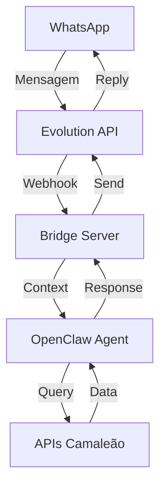

# 🤖 Atende Camaleão - Sistema Inteligente de Atendimento

Sistema de atendimento automático via WhatsApp para Camaleão Camisas, powered by OpenClaw AI.

## 🧠 Arquitetura Inteligente

Este não é um bot simples com respostas fixas. É um sistema de IA contextual que:
- **Entende contexto** - Mantém histórico completo da conversa
- **Acessa dados reais** - Consulta APIs do painel em tempo real
- **Toma decisões complexas** - Analisa pedidos, calcula prazos, sugere produtos
- **Aprende continuamente** - Melhora respostas baseado em feedback
- **Escala inteligentemente** - Sabe quando chamar humano

## 🚀 Instalação (Docker Compose)

```bash
# 1. Clone o repositório
git clone https://github.com/Wellingtoncamaleao/atende-camaleao.git
cd atende-camaleao

# 2. Configure as variáveis
cp .env.example .env
nano .env  # Configure suas credenciais

# 3. Inicie o sistema completo
docker-compose up -d

# 4. Configure o webhook da Evolution
curl -X POST http://localhost:3000/setup
```

## 🔧 Componentes

### 1. OpenClaw Agent (Cérebro)
- Motor de IA contextual
- Memória persistente por cliente
- Skills especializadas Camaleão
- Integração com APIs do painel

### 2. Bridge Server (Ponte)
- Recebe webhooks da Evolution API
- Traduz mensagens para OpenClaw
- Gerencia sessões por cliente
- Rate limiting e queue

### 3. Evolution API (WhatsApp)
- Conexão com WhatsApp Business
- Multi-device support
- Gerenciamento de instâncias
- Webhook events

## 🎯 Funcionalidades Inteligentes

### Consultas em Tempo Real
```
Cliente: "Qual o status do meu pedido 1234?"
Bot: [Consulta API] "Seu pedido está na impressão, previsão de entrega amanhã às 14h"
```

### Orçamento Contextual
```
Cliente: "Quero 100 camisetas com logo"
Bot: "Para camisetas com logo, temos:"
     - Malha 30.1: R$ 25/un
     - PV Premium: R$ 35/un
     "Qual tecido prefere?"
Cliente: "A mais barata"
Bot: "100 camisetas malha 30.1 = R$ 2.500"
     "Prazo de 5 dias úteis. Confirma?"
```

### Memória de Cliente
```
Cliente: "Oi"
Bot: "Olá João! Vi que seu último pedido foi entregue ontem."
     "Ficou satisfeito com as camisetas do evento?"
```

## 📊 APIs Integradas

- `/api/v1/pedidos.php` - Consulta status de pedidos
- `/api/v1/estoque.php` - Verifica disponibilidade
- `/api/v1/clientes.php` - Histórico do cliente
- `/api/v1/produtos.php` - Catálogo e preços
- `/api/v1/prazo.php` - Cálculo de prazos

## ⚙️ Configuração Avançada

### .env Principal
```env
# OpenClaw
OPENCLAW_API_KEY=oc_xxx
OPENCLAW_AGENT_ID=atende-camaleao
OPENCLAW_MODEL=anthropic/claude-haiku-4-5

# Evolution API
EVOLUTION_URL=https://evolution.gestorconecta.com.br
EVOLUTION_API_KEY=xxx
EVOLUTION_INSTANCE=camaleao

# Camaleão API
CAMALEAO_API_URL=https://painel.camaleaocamisas.com.br/api/v1
CAMALEAO_API_KEY=oc_a4f6e08fec8e2a64c388daf280aba64b93788206da2caa52a20b84433105e0f9

# Bridge Server
BRIDGE_PORT=3000
WEBHOOK_SECRET=xxx
RATE_LIMIT_PER_MIN=30
```

### Skills Customizadas

Criar arquivo em `skills/`:
```javascript
// skills/consulta-pedido.js
module.exports = {
  name: 'consulta-pedido',
  description: 'Consulta status de pedido',
  pattern: /pedido|status|entrega/i,
  async execute(context, apis) {
    const pedidoId = context.extractNumber();
    if (!pedidoId) {
      return "Por favor, informe o número do pedido.";
    }
    
    const pedido = await apis.camaleao.getPedido(pedidoId);
    if (!pedido) {
      return "Pedido não encontrado. Verifique o número.";
    }
    
    return `📦 Pedido #${pedidoId}
Status: ${pedido.status}
Cliente: ${pedido.cliente}
Valor: R$ ${pedido.valor}
Prazo: ${pedido.prazo}
${pedido.observacoes || ''}`;
  }
};
```

## 🔌 Endpoints

### Bridge Server
- `GET /` - Status do sistema
- `GET /health` - Health check
- `POST /webhook` - Recebe eventos Evolution
- `POST /setup` - Configura webhook Evolution
- `GET /sessions` - Lista sessões ativas
- `GET /metrics` - Métricas de atendimento

### OpenClaw Agent
- `POST /message` - Processa mensagem
- `GET /context/:phone` - Recupera contexto
- `POST /feedback` - Registra feedback
- `GET /analytics` - Analytics de conversas

## 📈 Monitoramento

```bash
# Logs em tempo real
docker-compose logs -f

# Métricas
curl http://localhost:3000/metrics

# Sessões ativas
curl http://localhost:3000/sessions

# Status OpenClaw
curl http://localhost:3000/openclaw/status
```

## 🛡️ Segurança

- **Rate Limiting** - 30 msgs/min por número
- **Session Timeout** - 30min inatividade
- **API Keys** - Todas protegidas
- **Webhook Secret** - Validação de origem
- **Data Encryption** - Mensagens criptografadas

## 📱 Fluxo de Atendimento



## 🚨 Troubleshooting

### Bot não responde
```bash
# Verificar todos os serviços
docker-compose ps

# Ver logs do OpenClaw
docker-compose logs openclaw

# Reiniciar sistema
docker-compose restart
```

### Respostas lentas
```bash
# Verificar fila
curl http://localhost:3000/queue

# Limpar cache
docker-compose exec openclaw npm run clear-cache
```

### Webhook não recebe
```bash
# Verificar configuração
curl http://localhost:3000/webhook/test

# Reconfigurar Evolution
curl -X POST http://localhost:3000/setup
```

## 🔄 Updates

```bash
# Atualizar código
git pull

# Rebuild containers
docker-compose build

# Restart com zero downtime
docker-compose up -d --no-deps --build openclaw
```

## 📊 Analytics Dashboard

Acesse `http://localhost:3000/dashboard` para ver:
- Mensagens processadas
- Taxa de resolução
- Tempo médio de resposta
- Principais dúvidas
- Satisfação dos clientes

## 🤝 Contribuindo

1. Fork o projeto
2. Crie sua feature branch (`git checkout -b feature/AmazingFeature`)
3. Commit suas mudanças (`git commit -m 'Add some AmazingFeature'`)
4. Push para a branch (`git push origin feature/AmazingFeature`)
5. Abra um Pull Request

## 📞 Suporte

- **Técnico**: Wellington Camaleão
- **WhatsApp**: (11) 94567-8900
- **Email**: suporte@camaleaocamisas.com.br

## 📜 Licença

Proprietário - Camaleão Camisas © 2024

---

**Powered by OpenClaw AI 🧠**